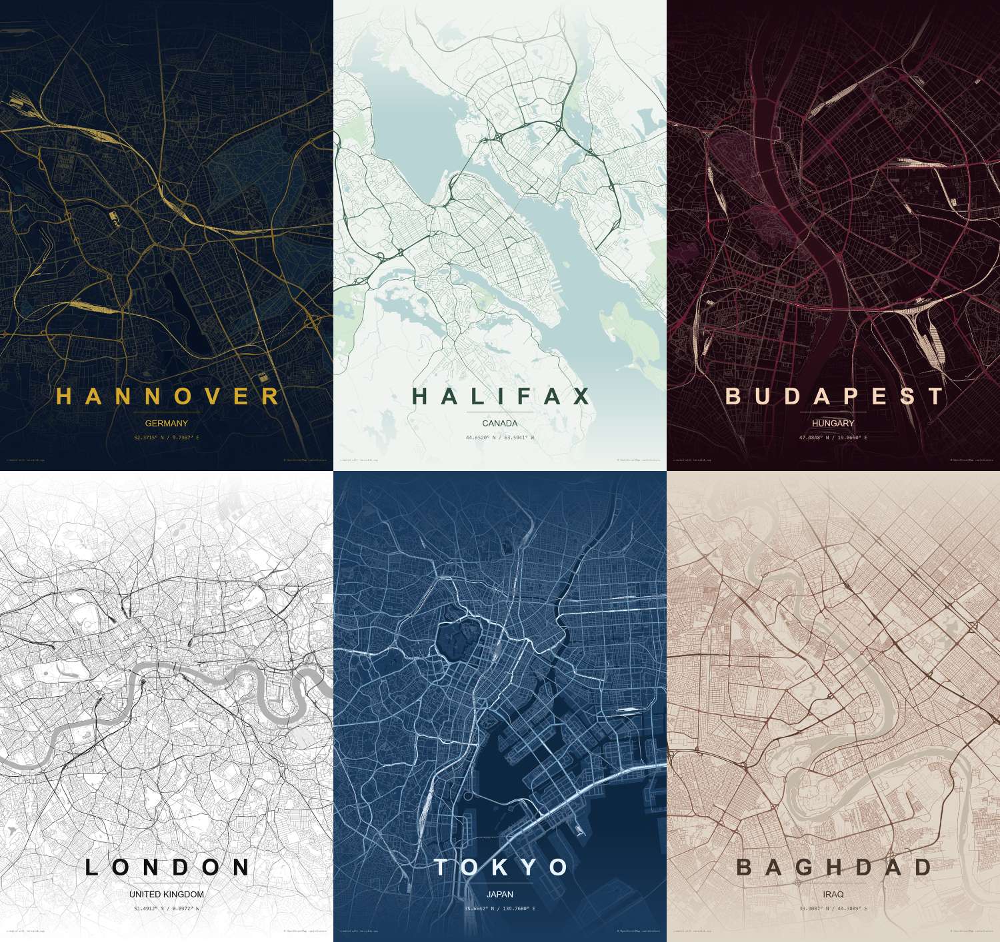

# Atlasify

**Turn any place into a poster.**

Atlasify is a free map poster generator. Search any city or enter coordinates, pick from 23 hand-crafted themes, and export a print-ready poster as PNG, PDF, or SVG — all in your browser.

Hi-res exports (2K, 4K, 8K) available as a one-time purchase.

**[Try it now →](https://atlasifyy.vercel.app)**

---

## What you get

- **23 themes** — Atlas, Cyberpunk, Ember, Ruby, Emerald, Noir, Dusk, Terracotta, Saffron, Coral, Sage, Forest, Ocean, Sand, Arctic, Copper, Patina, Parchment, Blueprint, Ink Wash, Monochrome, Slate, Mist
- **Any location** — search by city name or enter exact lat/lon coordinates
- **Free exports** — PNG, PDF, and SVG at standard resolution
- **Hi-res exports** — 2K, 4K, and 8K PNG (one-time purchase)
- **Full customization** — colors, typography, map layers, markers
- **Works offline** — install as a PWA
- **No sign-up required**

---

## Screenshots

  

  

---

## Credits

- Map data by [OpenStreetMap](https://www.openstreetmap.org/copyright) contributors
- Vector tiles by [OpenFreeMap](https://openfreemap.org/)

---

Built by [KJR Labs](https://kjrlabs.in) · [@kshitijkoranne](https://x.com/kshitijkoranne)
